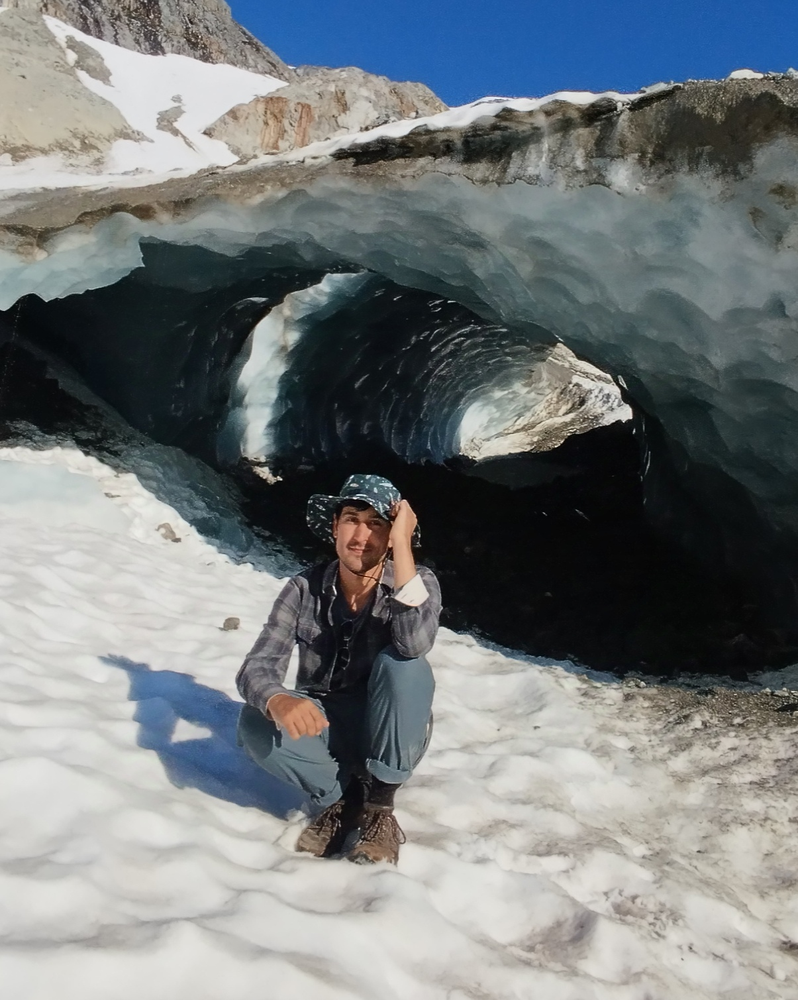

# Gonzalo González de Diego

**Marie-Curie Postdoctoral Fellow**  
E.T.S.I. Telecomunicación  
Universidad Politécnica de Madrid (UPM), Spain  

[Google Scholar](https://scholar.google.com/citations?user=VIOEniAAAAAJ&hl=en) | [GitHub](https://github.com/gonzalogddiego) | [Bitbucket](https://bitbucket.org/gonzalogddiego/workspace/overview/) | [CV](cv.pdf) | [Email](mailto:g.gonzalezd@upm.es)

---

## About Me

I am a **Marie-Curie Fellow** at the **Universidad Politécnica de Madrid (UPM)** in the School of Telecommunication Engineering. I am working in the [Grupo de Simulación Numérica en Ciencias e Ingeniería](https://www.gsnci.upm.es/es/inicio/) (GSNCI), led by [Prof Francisco Navarro](https://portalcientifico.upm.es/es/ipublic/researcher/307362), on Bayesian inverse problems in glaciology. 

Previously, I was a Postdoctoral Research Associate from 2023 to 2026 at the **Courant Institute of Mathematical Sciences (NYU)** working with [Prof. Georg Stadler](https://math.nyu.edu/~stadler/) on rheology discovery and sea ice dynamics as part of the [*Sea Ice MURI*](https://seaicemuri.org/) project. 

I completed my PhD in 2023 at the **Mathematical Institute (University of Oxford)** under the supervision of [Prof. Ian Hewitt](https://people.maths.ox.ac.uk/hewitt/) and [Prof. Patrick Farrell](https://pefarrell.org/), focusing on viscous contact problems and free-boundary modeling in glaciology.

### Research Interests
* **Glaciology:** Marine ice sheet dynamics, subglacial cavity formation, sea ice rheology.
* **Numerical Analysis & PDE Constrained Optimization:** Finite element methods, variational inequalities, inverse problems.
* **Data-driven & Learned Rheologies:** Inferring continuum model parameters from particle scale dynamics.

---

## Publications

### Preprints
<ol reversed markdown="1">
</ol>

### Peer-Reviewed Journal Articles
<ol reversed markdown="1">
<li markdown="1">

**G.G. de Diego**, G. Stadler (2026).  
  *Learning parameter-dependent shear viscosity from data, with application to sea and land ice.*  
  **Journal of Computational Physics**, 114971. [[DOI](https://doi.org/10.1016/j.jcp.2026.114971)] [[arXiv](https://arxiv.org/abs/2511.10452)]

</li>
<li markdown="1">

**G.G. de Diego**, G. Stadler (2026).  
  *Non-Newtonian viscous fluid models with learned rheology accurately reproduce Lagrangian sea ice simulations.*  
  **Physical Review Fluids**, 11(1), 013301. [[DOI](https://doi.org/10.1103/j4qf-s1th)] [[arXiv](https://arxiv.org/abs/2405.08123)]

</li>
<li markdown="1">

**G.G. de Diego**, M. Gupta, S.A. Gering, R. Haris, G. Stadler (2025).  
  *Modeling sea ice in the marginal ice zone as a dense granular flow with rheology inferred from a discrete element model.*  
  **Journal of Fluid Mechanics**. [[DOI](https://doi.org/10.1017/jfm.2024.1026)] [[arXiv](https://arxiv.org/abs/2405.08123)]

</li>
<li markdown="1">

D. Shapero, **G.G. de Diego** (2025).  
  *Numerical simulation of glacier terminus evolution using the dual action principle for momentum balance.*  
  **Journal of Glaciology**. [[DOI](https://doi.org/10.1017/jog.2024.92)]

</li>
<li markdown="1">

**G.G. de Diego**, P.E. Farrell, I.J. Hewitt (2023).  
  *On the finite element approximation of a semicoercive Stokes variational inequality arising in glaciology.*  
  **SIAM Journal on Numerical Analysis**. [[DOI](https://doi.org/10.1137/21M1437640)] [[arXiv](https://arxiv.org/abs/2108.00046)]

</li>
<li markdown="1">

**G.G. de Diego**, P.E. Farrell, I.J. Hewitt (2022).  
  *Numerical approximation of viscous contact problems applied to glacial sliding.*  
  **Journal of Fluid Mechanics**. [[DOI](https://doi.org/10.1017/jfm.2022.178)] [[arXiv](https://arxiv.org/abs/2111.05593)]

</li>
<li markdown="1">

F. Bertrand, D. Boffi, **G.G. de Diego** (2021).  
  *Convergence analysis of the scaled boundary finite element method for the Laplace equation.*  
  **Advances in Computational Mathematics**. [[DOI](https://doi.org/10.1007/s10444-021-09852-z)] [[arXiv](https://arxiv.org/abs/2005.02287)]

</li>
<li markdown="1">

**G.G. de Diego**, A. Palha, M. Gerritsma (2019).  
  *Inclusion of no-slip boundary conditions in the MEEVC scheme.*  
  **Journal of Computational Physics**. [[DOI](https://doi.org/10.1016/j.jcp.2018.11.025)]

</li>
<li markdown="1">

R. Bardera-Mora, M. A. Barcala-Montejano, A. Rodríguez-Sevillano, **G. G. de Diego**, M. Ruiz de Sotto (2015).  
  *A spectral analysis of laser Doppler anemometry turbulent flow measurements in a ship air wake.*  
  **Proc. IMechE Part G: J. Aerospace Engineering**. [[DOI](https://doi.org/10.1177/0954410015573972)]

</li>
</ol>

### PhD Thesis
* **G.G. de Diego** (2023). *Viscous contact problems in glaciology*. DPhil Thesis, University of Oxford. [[Oxford Research Archive](https://ora.ox.ac.uk/objects/uuid:53d5fa2b-1ec6-4c34-be47-93184afa74d0)]

---

## Contact

**Office:** Escuela Técnica Superior de Ingenieros de Telecomunicación (ETSIT)  
**Universidad Politécnica de Madrid**  
Av. Complutense, 30, 28040 Madrid, Spain  
**Email:** `g.gonzalezd [at] upm.es`